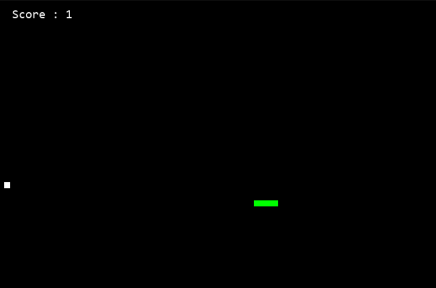
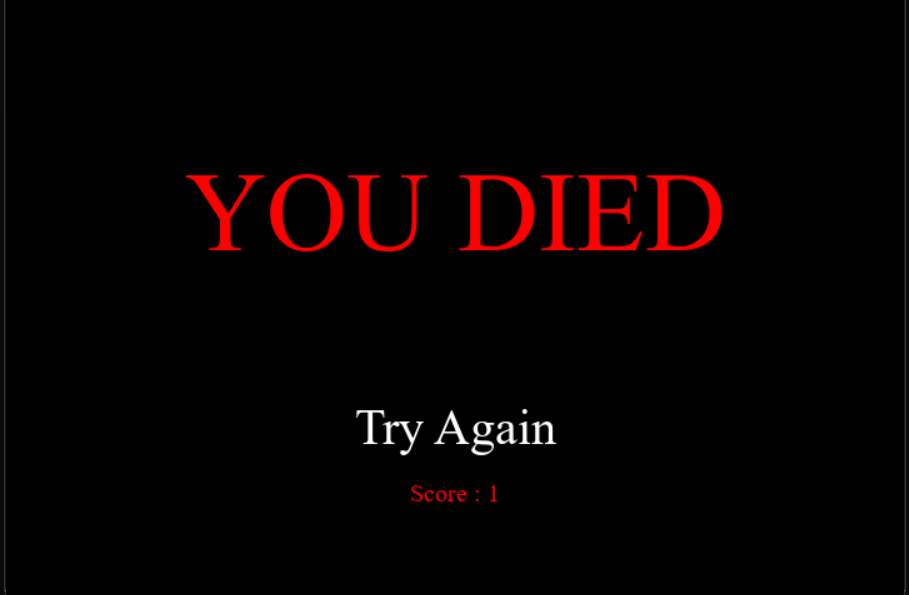

# Snake Game in Python

A classic Snake Game implemented in Python using the Pygame library.





## Description

This project implements the popular Snake Game using Python and the Pygame library. Players control a snake that grows in length whenever it consumes food. The objective is to eat as much food as possible while avoiding collisions with the boundaries of the game window and the snake's own body.

## Features

- Classic Snake gameplay experience.
- Real-time score display.
- Game Over screen with a "Try Again" button.
- Adjustable difficulty level.

## Installation

1. Clone the repository to your local machine:

```
git clone git@github.com:kabirvirk51/python-snake-game.git
```

2. Install the required dependencies using pip:
```
pip3 install pygame
```
3. Run the game:
```
python3 python-snake-game.py
```
## Controls

- Use the arrow keys or the 'W', 'A', 'S', 'D' keys to control the snake's direction.
- Press 'Esc' to quit the game.

## Contributing

Contributions are welcome! If you find any bugs or have suggestions for improvements, please open an issue or submit a pull request.

## Credits

- This game is built using the [Pygame](https://www.pygame.org/) library.

## License

This project is licensed under the MIT License - see the [LICENSE](LICENSE)
